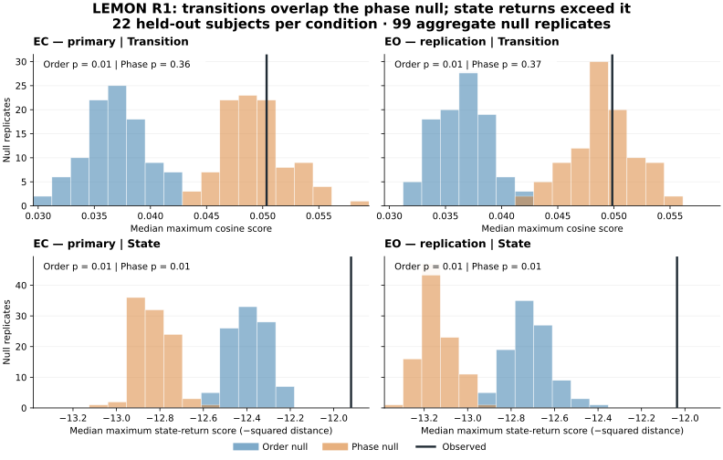

# R1 LEMON: linear-lag transitions and stronger state-return evidence

Date: 5 October 2026. Source: the user's canonical
[`r1-lemon-full.json`](../../results/receipts/r1-lemon-full.json), uploaded to main
in commit `392f74796354c0ba9a7fb914170c32886c252793`. This is an audit and
interpretation of saved results; the 26 EEG recordings were not reprocessed.

**R1 passes its frozen transition gate at the linear-lag tier in both EC and EO.**
The transition statistic beats the order-destroying control, but does not reject
the phase-preserving control. Matched state recurrence passes both controls.
The frozen interpretation is therefore **`STATE_RECURRENCE_DOMINANT`** in both
conditions. Resting temporal structure is present under these tests; the stronger
proposed dissociation, recurring transformations without comparable state return,
is not the population result obtained here.

## Population and decision rule

| Receipt quantity | Value |
|---|---:|
| Discovered subjects | 26 |
| Deterministic development subjects | 3 |
| Assigned held-out subjects | 23 |
| Usable held-out subjects, EC / EO | 22 / 22 |
| Successful subject-condition rows | 50 / 52 |
| Skipped rows | 2, both `sub-032309` |
| Physical blocks per successful condition | 8 |
| Held-out physical blocks per condition | 176 |
| Null replicates | 99 |

The development subjects are `sub-032302`, `sub-032308`, and `sub-032343`.
They do not contribute to the reported population verdicts. EC is the frozen
primary condition; EO is replication using the **same 22 people**. Agreement
between conditions is useful within-dataset replication, rather than another
independent cohort. LEMON is a separate dataset from the EEGMMIDB experiment that
motivated R1. These available downloads are not documented as a representative
sample of the full LEMON population.

The canonical rule requires at least 20 usable held-out EC subjects and at least
19 null replicates. This receipt satisfies both and is not exploratory. Each
population comparison passes only if its upper-tail permutation value is at most
0.05 **and** at least two-thirds of subjects have a real score above their own
null median. Passing the phase tier also requires passing the order tier.

## Numerical result

| Condition | Metric | Null | Real median | Aggregate null median | p | Positive subjects | Pass |
|---|---|---|---:|---:|---:|---:|---|
| EC | Transition | Order | 0.050347 | 0.036764 | 0.01 | 22/22 | Yes |
| EC | Transition | Phase | 0.050347 | 0.048791 | 0.36 | 14/22 | No |
| EC | State | Order | −11.920239 | −12.380572 | 0.01 | 18/22 | Yes |
| EC | State | Phase | −11.920239 | −12.814981 | 0.01 | 22/22 | Yes |
| EO | Transition | Order | 0.049855 | 0.036719 | 0.01 | 19/22 | Yes |
| EO | Transition | Phase | 0.049855 | 0.048744 | 0.37 | 9/22 | No |
| EO | State | Order | −12.036341 | −12.711920 | 0.01 | 19/22 | Yes |
| EO | State | Phase | −12.036341 | −13.154539 | 0.01 | 22/22 | Yes |

The histograms show the 99 saved aggregate null scores. Every subject's real
statistic and every subject/null replicate take their own maximum over the frozen
2–20 second lag grid; population aggregation then takes the median across
subjects. The null therefore includes the same lag search as the observation.
The two metric rows use different units and cannot be compared as effect sizes.

All comparisons with `p = 0.01` exceed all 99 sampled aggregate null scores.
That is the resolution floor, computed as `(1 + exceedances) / 100`; it does not
justify reporting a smaller p-value. For transition/phase, 35/99 EC null scores
and 36/99 EO null scores equal or exceed the observation. EC also misses the
two-thirds direction threshold at 14/22; EO is below it at 9/22.

## What is recurring?

The measured trajectory contains 0.5-second band-power feature epochs, robust
scaling/clipping, and up to eight standardized PCA coordinates. One PCA basis is
fitted per subject/condition, while physical blocks stay separate for lag pairs.
With half-window 1, a local transition is `z[t+1] − z[t−1]`. Transition recurrence
compares directions using cosine similarity. State recurrence uses negative
squared distance, so a less negative score means a closer state return. Each
spectrum takes medians across pairs within a block and then across blocks.

The transition order null permutes the already computed displacement vectors
within each block; the state order null permutes the PCA states within each
block. These retain their respective empirical vector/state distributions while
destroying temporal ordering. Passing them establishes temporal dependence under
these metrics. Autocorrelation and smooth lag structure can already produce
such a result.

The phase null multiplies each Fourier frequency by a random phase **shared
across PCA dimensions**, preserving auto-spectra, complex cross-spectra, and
circular second-order lagged correlations within a block. It then reconstructs
the trajectory and recomputes the metrics. The real transition scores overlap
this stronger control. Thus the transition result is compatible with the retained
linear lag structure under this test. Failure to reject that null does not prove
that neural biology is linear or exclude effects the statistic cannot detect.

The state statistic exceeds both controls. Its receipt label is
`BEYOND_LINEAR_RECURRENCE`, an operational classification against these specific
surrogates. It does not on its own establish a nonlinear circuit, attractor, or
memory operation. Fourier phase randomization does not retain the original
marginal distribution or temporal amplitude organization, and it can disrupt
nonstationary structure. Finite blocks also distinguish circular spectral
constraints from the non-wrapping pairs used by the recurrence statistic.
Band-power extraction and clipping already transform the signal before this
comparison. Their contributions to phase-null rejection are unresolved here.

This distinction follows the surrogate-testing literature: distribution-aware
controls address broader hypotheses than a Gaussian linear process, while
nonstationarity can itself cause rejection of stationary surrogates. See
[Schreiber & Schmitz (1996)](https://doi.org/10.1103/PhysRevLett.77.635) and
[Schmitz & Schreiber (1999)](https://arxiv.org/abs/chao-dyn/9904023).
The application to this receipt is an interpretation of the implemented null,
not an identified explanation of the observed state effect.

`STATE_RECURRENCE_DOMINANT` compares the **ordinal null tiers**, not the numerical
magnitudes of cosine similarity and squared distance. It says the state metric
reaches a stronger control tier than the transition metric. It neither says that
states drive transitions nor measures relative biological importance.

## Heterogeneity and timescales

A population pass does not mean every subject individually passes. In EC, 7/22
subjects have a linear-tier transition classification and 15/22 have no robust
individual transition classification; none reach the phase tier. EO has six
linear-tier, one phase-tier, and 15 without robust individual transition
recurrence. Individual state recurrence reaches the phase tier in 14/22 EC and
9/22 EO subjects. The positive direction in all 22 state/phase comparisons is
therefore not a claim of significance in every person.

Transition peak lags vary across subjects. EC's most frequent peak is 17.5 seconds
in only 4/22 people; the other peaks span the search range. Because each subject
chooses its own maximum, the population result does not establish a common
oscillation period. The 2–20 second lags describe returns in band-power feature
space, rather than a raw EEG carrier frequency or an anatomical circuit delay.

## The annotation warning and excluded recording

The receipt skips `sub-032309` in both conditions because neither condition has
four usable physical blocks. A public-source metadata audit supplies a concrete
explanation consistent with the reported warning:

- The [S3 archive for sub-032309](https://fcp-indi.s3.amazonaws.com/data/Projects/INDI/MPI-LEMON/Compressed_tar/EEG_MPILMBB_LEMON/EEG_Raw_BIDS_ID/sub-032309.tar.gz)
  declares an EEG member of 120,586,240 bytes. The
  [official older-ID directory, sub-010015](https://ftp.gwdg.de/pub/misc/MPI-Leipzig_Mind-Brain-Body-LEMON/EEG_MPILMBB_LEMON/EEG_Raw_BIDS_ID/sub-010015/RSEEG/)
  lists the same length, and its header and marker bytes match the S3 metadata.
- The header specifies 62 channels, 16-bit samples, and 2,500 Hz. The file length
  contains 972,469 complete sample frames plus 84 trailing bytes, approximately
  388.988 seconds of EEG. Markers extend to 1,045.241 seconds.
- An MNE 1.13.2 **metadata-only** read, using a sparse placeholder of that
  confirmed byte length with the actual header/markers and `preload=False`,
  reproduces `Omitted 313 annotation(s) that were outside data range.`
  The current block parser retains three EC and three EO blocks.

The [metadata audit](r1-lemon-source-metadata-audit.json) records this check's
scope and source hashes. No placeholder values were used for feature extraction
or recurrence analysis. The local Windows recordings were not inspected, so the
public match identifies a consistent source-file explanation rather than proving
that every local download has identical bytes. This check does not recover the
missing signal. Keeping the exclusion preserves the four-block rule; the 22
remaining held-out subjects meet the population minimum.

## Artifact diagnostics and audit limits

Held-out median clipped **feature-value** fractions are 4.55% in EC and 5.59% in
EO, with ranges 3.48–7.42% and 3.42–8.29%. These are robust-scaled feature entries,
not raw EEG samples or a percentage of unusable recording time. EC's association
between clipping burden and transition/order effect is weak: Pearson
`r = −0.121`, Spearman `r = −0.062`, `n = 22`. This diagnostic does not establish
that the result is artifact-free or resolve artifacts affecting the state metric.

The fresh saved-output audit passes **1,807 checks with zero mismatches**:
original bytes/hash, configuration fingerprint, deterministic split, complete
unique condition rows, block counts, finite spectra/nulls, peak/max statistics,
individual p-values/directions/classes, all aggregate null arrays and verdicts,
and artifact fractions/correlations. Independent arithmetic and the frozen runner
both reproduce the population result. The
[compact summary](../../results/receipts/r1-lemon-full-summary.json) retains the
source checksum, counts, tables, and descriptive subject classifications.

The full receipt is 839,585 bytes, SHA-256
`5035a94994e15e2c577021f01016af6c3ae00f02da669df2272974dda4c4f632`.
It records package version `0.1.0` and the numerical configuration, but not the
exact installed git revision, dependency versions, or raw-input checksums.
Per-block spectra and usable-pair counts are not retained. These checks verify
the saved calculations and internal consistency; they are not a fresh analysis
of all original EEG data or an independent replication of the result.

## Consequences for resonance valves and the next test

The independent resting dataset shows temporal structure in the current EEG
feature representation. It narrows the proposed “same transformation without
same state” story: at population level, matched state return survives the stronger
control while transition recurrence reaches only the linear-lag tier. The
event-aligned Gate 1C result and spontaneous R1 result therefore answer different
questions. R1 has not tested transfer of a frozen task-derived T0 template.

Neither metric measures dendritic inhibition, excitatory gain, a reset, cell
identity, or seizure prevention. The
[resonance-valve hypothesis](../interpretation/2026-10-05-resonance-valves.md)
still calls for a controlled feedback/gain intervention and separate tests of
retained history and stability. Gate 1B remains FAIL; Gate 1C remains a
same-dataset follow-up. R1 is the separately approved follow-up and does not
retroactively advance the original failed ladder.

For the EEG result, the next informative study would freeze a broader
multivariate surrogate that checks both marginal-distribution and cross-spectral
constraints, plus a nonstationarity control, before running an independent
cohort. Applying univariate amplitude adjustment independently to PCA dimensions
can lose cross-spectral constraints, so those properties must be verified rather
than assumed. Keep the present receipt and its frozen verdict intact; any new
controls or channel/band analyses should be labeled follow-ups. That separates
the measured resting structure from a later explanation of what produces it.
